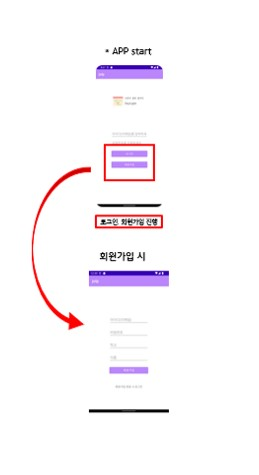
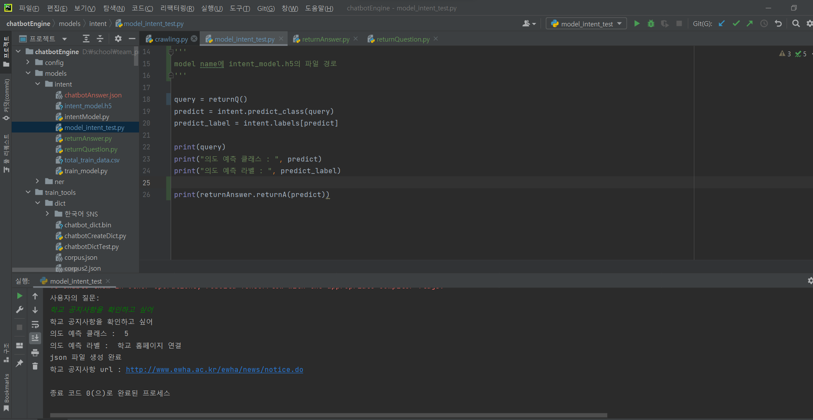

1. 어플 앱을 android 스마트폰에 download 한다. (하단에 링크 있습니다)
2. 회원가입 버튼을 누르고 임의 이메일, 비밀번호, 학교, 이름을 입력하여 계정을 생성한다.
3. 촤측 상단 메뉴를 클릭한 후, 주간 시간표로 이동한다.
4. 우측 하단의 아이콘을 클릭하면 아이콘 3개가 뜨는데 위에서부터 강의계획서 검색 일정 추가, 임의 일정 추가, 챗봇 버튼이다.
5. 강의계획서 검색 일정 추가버튼을 눌러 분반과 학수번호를 입력하여 강의 일정을 추가한다.
6. 임의 일정 추가 버튼을 눌러 임의의 일정을 추가한다. (시간 입력은 입력창을 더블클릭하면 시간 입력용 창이 뜬다)
7. 추가된 일정을 길게 눌러 삭제한다.
8. 우측 하단의 챗봇 버튼을 눌러 인사, 강의 추가, 강의 삭제, 학교 홈페이지 연결 주제로 대화할 수 있다.
  ex> 강의 추가는 어떻게 할 수 있어? / 학교 공지사항은 어디서 확인해?
[app-debug.zip](https://github.com/HellenHong/DoitProgram/files/8875670/app-debug.zip)
압축 풀면 apk 파일이있습니다. 

****챗봇 기능이 돌아가지 않을 경우 테스트하는 방법****
1. DoitProgram(main)에서 ChatBot 폴더를 찾는다.
2. 다음 파일들을 다운받는다.
경로도 함께 지정해주어야 한다.
github에 올려둔 경로 기준
ChatBot - utils - chatbotPreprocessing.py
ChatBot - utils - user_dict.csv
ChatBot - config - GlobalParams.py
ChatBot - models - intent - intentModel.py
ChatBot - models - intent - model_intent_test.py
ChatBot - models - intent - returnAnswer.py
ChatBot - models - intent - returnQuestion.py
ChatBot - models - intent -> readme.txt의 다운로드링크에서 intent_model.h5 다운 (intent 폴더에 넣어주면 됩니다)
ChatBot - train_tools - dict - chatbot_dict.bin

필요한 라이브러리는
konlpy -> Komoran 이용
tensorflow -> keras 이용
json

위 파일들을 저장한 후 pycharm이나 colaboratory에서 실행한다.
model_intent_test.py 파일을 실행한다.

질문을 입력한다.
답변을 확인한다.

