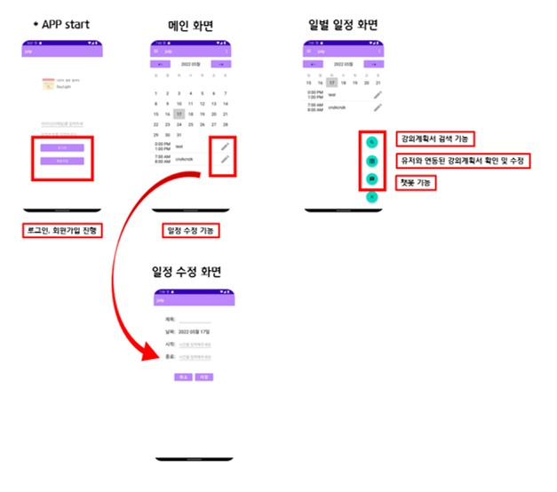

1. 어플 앱 (위치 추가) 을 android 스마트폰에 download 한다.
2. (추가) id와 (추가) 비밀번호를 입력하여 log in 한다.
3. 우측 하단의 아이콘을 클릭하여 강의 추가 버튼을 누르고, 강의명을 선택하여 일정을 추가한다.
4. 추가된 일정을 길게 눌러 삭제한다.
5. 우측 하단의 챗봇 버튼을 눌러 인사, 강의 추가, 강의 삭제, 학교 홈페이지 연결 주제로 대화할 수 있다.
  ex> 강의 추가는 어떻게 할 수 있어? / 학교 공지사항은 어디서 확인해?
[app-debug.zip](https://github.com/HellenHong/DoitProgram/files/8875670/app-debug.zip)
압축 풀면 apk 파일이있습니다. 

